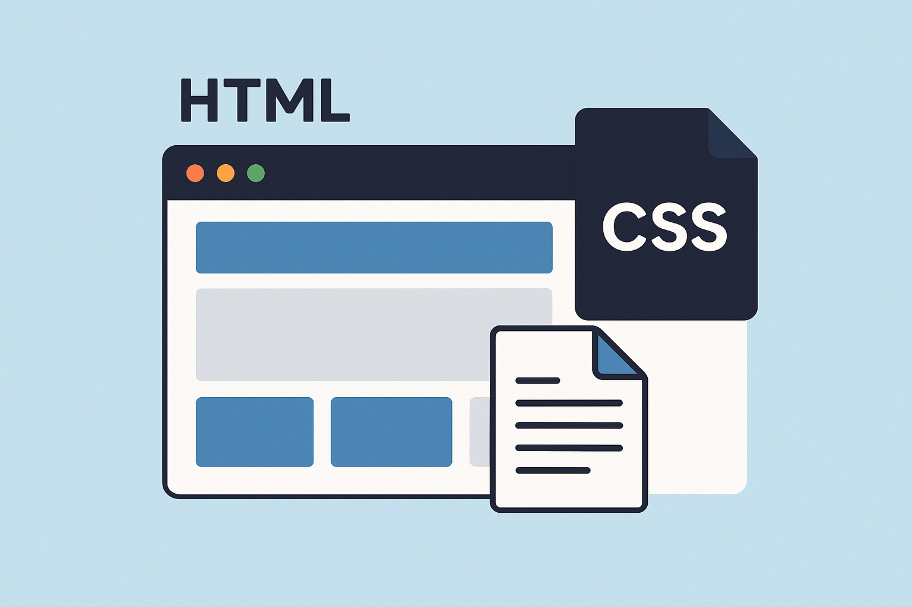
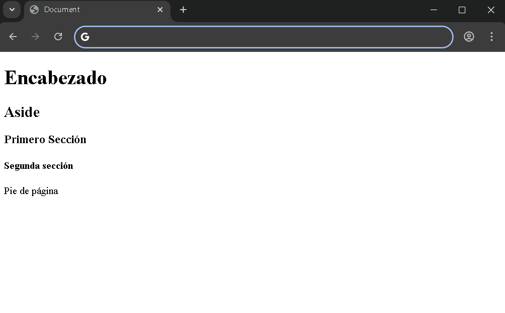
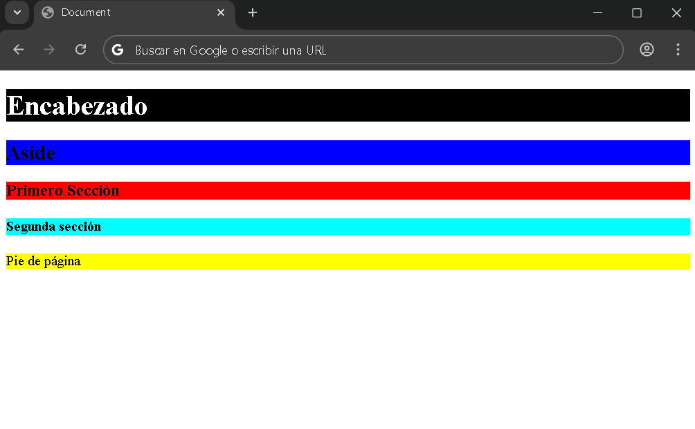
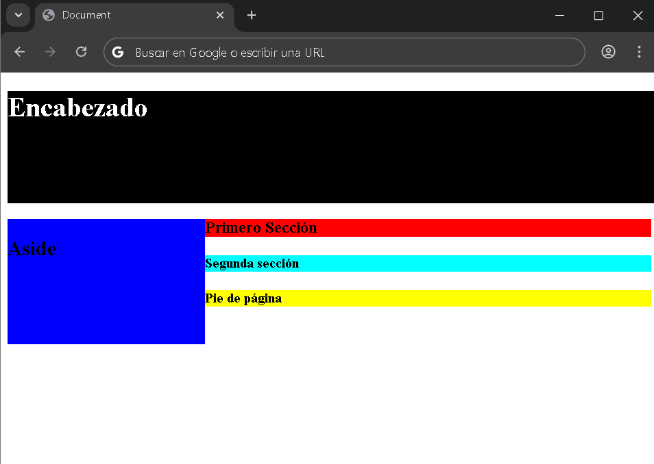
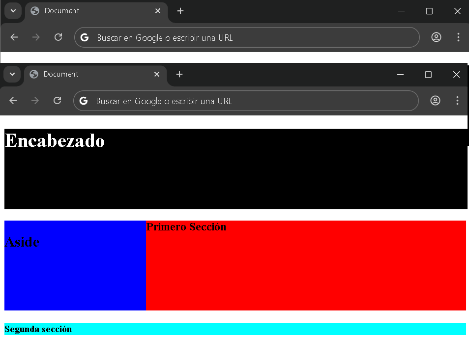
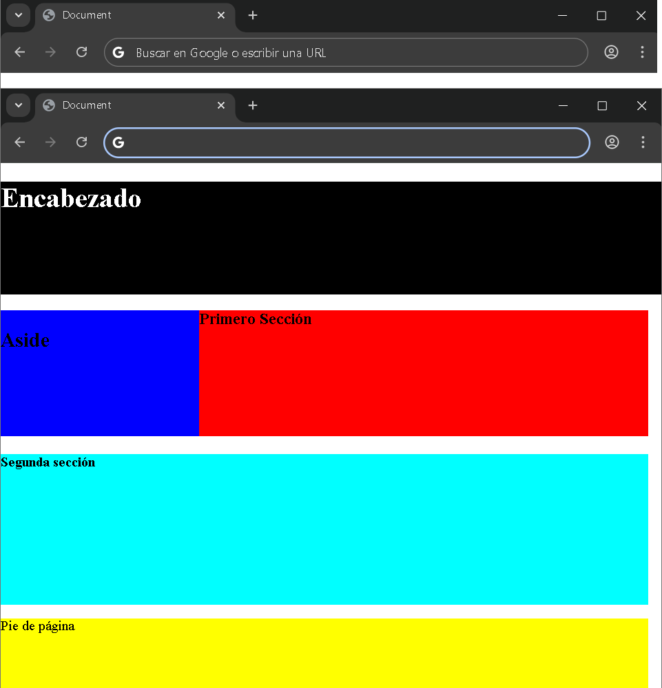
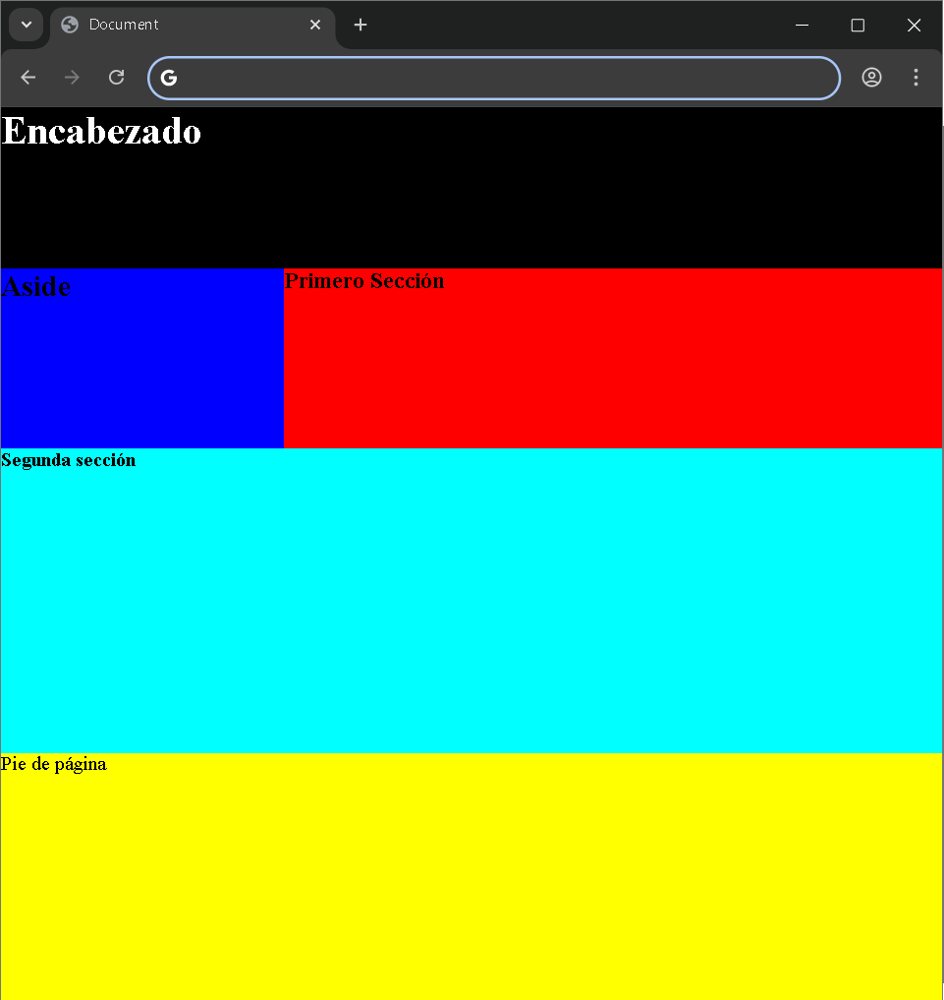

<div style="text-align: justify">

# CSS - Maquetación.

<div style="text-aling: center">



</div>

La maquetación en `CSS` tiene como finalidad brindar al usuario una estructura visual avanzada, personalizada y aatractiva, que facilite la identificación de cada parte del contenido y destaque los elementos más importantes según el caso.

En esta ocasión comenzaremos con ejemplos de maquetación en `CSS`. Para ello, primero estableceremos la estructura básica en `HTML`. Dentro del documento agregaremos un `<header>`, seguido de un `<article>`, y dentro de este último incluiremos un `<aside>` y dos `<section>`, cada una con una clase diferente: una será *sec1* y la otra *sec2*. Finalmente, añadiremos el pie de página, representado por el `<footer>`.

**Importante: No debemos olvidar vincular el archivo `CSS` al documento `HTML`**

Además, cada sección deberá contener información. En el *header* colocaremos un título con la etiqueta `h1`. En cada section dentro del artículo utilizaremos subtítulos como `h2`, `h3` o `h4`. Para el *footer*, incluiremos un párrafo que servirá de contenido de práctica.

De esta manera tendremos listo el `body` del documento, que nos permitirá trabajar en el ejemplo de maquetación en `CSS`.

```HTML
<body>
    <header>
        <h1>Encabezado</h1>
    </header>
    <article>
        <aside>
            <h2>Aside</h2>
        </aside>
        <section class="sec1">
            <h3>Primero Sección</h3>
        </section>
        <section class="sec2">
            <h4>Segunda sección</h4>
        </section>
    </article>
    <footer>
        <p>Pie de página</p>
    </footer>
</body>
```

A continuación, una imagen demostrativa de nuestro documento `HTML`, sin ningún estilo `CSS`:

<div style="text-align: center">



</div>

Ahora comenzaremos a trabajar con nuestro código `CSS`. El primer elemento al que aplicaremos estilo será el **header**. Para ello, le asignaremos un color de fondo negro utilizando la propiedad `background-color` con el valor `black`. Además, modifcaremos el contenido del elemento **h1** para que el texto se vea en color blanco, lo cual haremos a través de la propiedad `color`, declarando el valor  `white`.

```CSS
header{
    background-color: black;
    color: white;
}
```

A continuación, le daremos colores de fondo a los demás elementos **aside** y le daremos **bacnkground-color** de color azul (*blue*).

Así se tendría que estar viendo nuestro documento:

<div style="text-align: center">


</div>

Ahora aplicaremos estilos de fondo a diferentes elementos. A la clase `sec1`le asignaremos un color de fondo rojo, mientras que a la clase `sec2` le daremos un color de fondo *aqua*. Recuerde que en `CSS`, para seleccionar una clase debemos colocar un punto antes de su nombre. Finalmente, al elemento `footer` le estableceremos un color de fondo amarillo.

```CSS
.sec1{
    background-color: red;
}
.sec2{
    background-color: aqua;
}
footer{
    background-color: yellow;
}
```

A continuación, veremos en una imagen como nos debe quedar el documento de ejemplo:

<div style="text-align: center">



</div>

Por el momento, únicamente hemos trabajado con los colores de los elementos. A contonuación, comenzaremos con la maquetación. Para ello, en el `body` asignaremos la propiedad `width` (*ancho*) con el valor **100vw** y la propiedad `height` (*alto*) con el valor **100vh**. Estas unidades representan el `100%` del ancho y de la altura de la ventana del navegador, respectivamente. Este tipo de maquetación es dinámica, lo que significa que se ajusta automáticamente al tamaño de la ventana. En la actualidad, este enfoque es muy utilizado, ya que permite que el diseño sea responsivo y se adapte fácilmente a diferentes tamaños de pantalla.

Para distribuir el espacio entre los elementos, asignaremos al encabezado un ancho de `100vw`, de modo que ocupe todo el ancho de la página, y una altura de `18vh`. El artículo tendrá también un ancho de `100vw` y una altura de `54vh`. Al elemento **aside** le agregaremos una propiedad adicional: `float`con el valor `left`. Esto permitirá que el **aside** deje espacio disponible a su derecha para que pueda ubicarse otro elemento. Además, el **aside** tendrá un ancho de `30vw` y una altura de `20vh`. Finalmente, observaremos en una imagen cómo debería quedar nuestro documento de ejemplo.

<div style="text-align: center">



</div>

continuaremos con `sec1`. Le daremos el resto del alto que serían **20vh**, que sería la misma altura que el **aside**.

Código de ejemplo:

```CSS
header{
    background-color: black;
    color:white;
    height: 18vh;
    width: 100vw;

}
aside{
    background-color: blue;
    width: 30vw;
    height: 20vh;
    float: left;

}
.sec1{
    background-color: red;
    height: 20vh;
}
.sec2{
    background-color: aqua;
}
footer{
    background-color: yellow;
}
```
**Documento**:

<div style="text-align: center">



</div>

A continuación, trabajaremos con la `sec2`, asignándole un ancho de **100vw** y una altura de **24vh**. Finalmente,  nos queda el `footer`,
al cual le daremos un ancho total de `100vw` y una altura correspondiente al especio restante. Si al total de 100 restamos la altura del encabezado **(18)** y la del artículo **(54)**, obtenemos `18vh`, que será la altura asignada al `footer` para completar toda la estructura del **body**.

**Documento**:

<div style="text-align: center">



</div>

Solo nos resta eliminar los márgenes predeterminados de las etiquetas `h1`, `h2`, `h3`, `h4` y `p`, así como el margen que el `body` trae por defento. Para lograrlo, utilizaremos el selector de elementos indicando al `body` y a cada una de estas etiquetas, asignándoles un valor de `margin: 0;`.

**Documento**:

<div style="text-align">



</div>
</div>